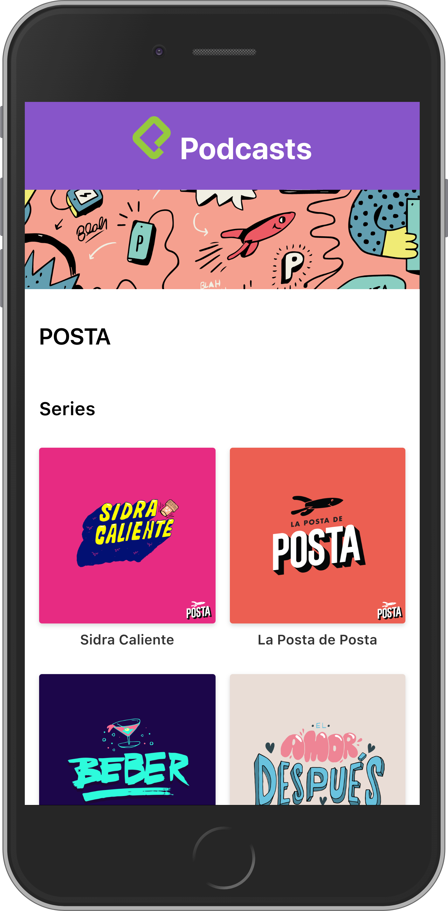

# Podcasts App integrated with React y Next.JS

Podcasts app created with AudioBoom's API to learn Next.JS framework

## How does it works?

Node.JS 10 required

* `npm install` to install dependecies
* `npm run dev` to start dev environment
* `npm run build && npm start`to run production environment

## Licended

MIT